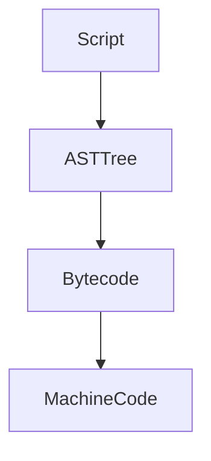
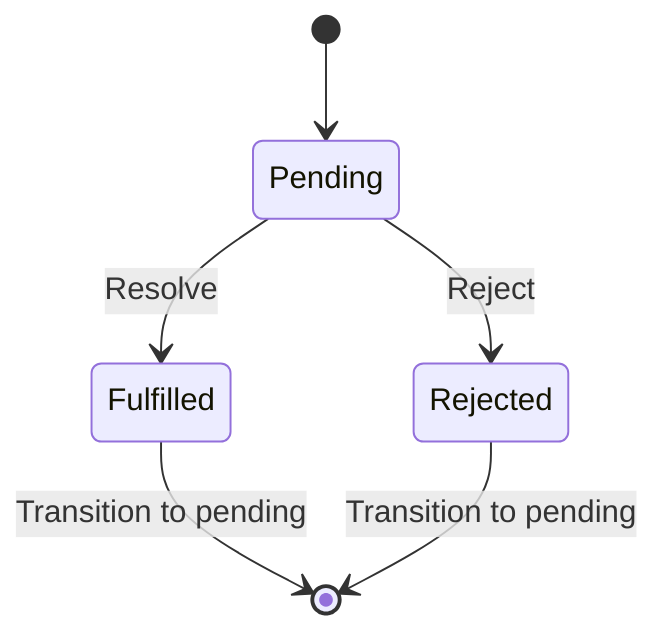
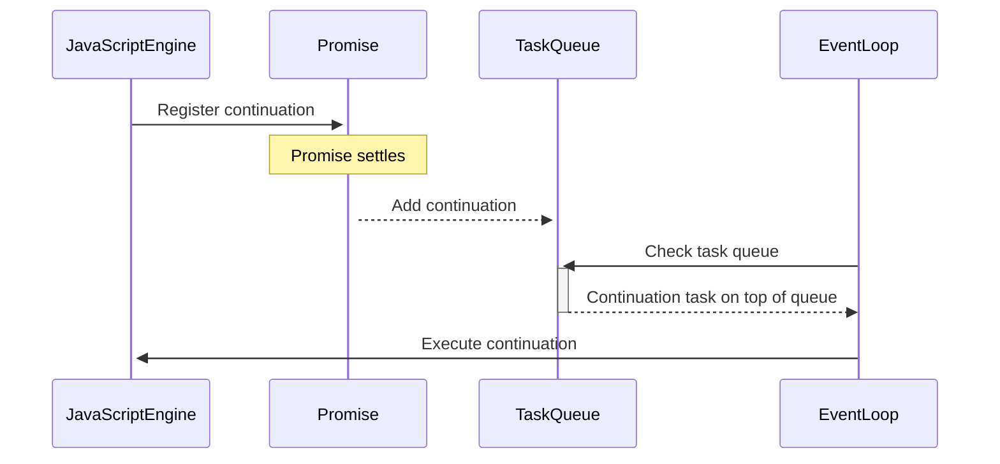
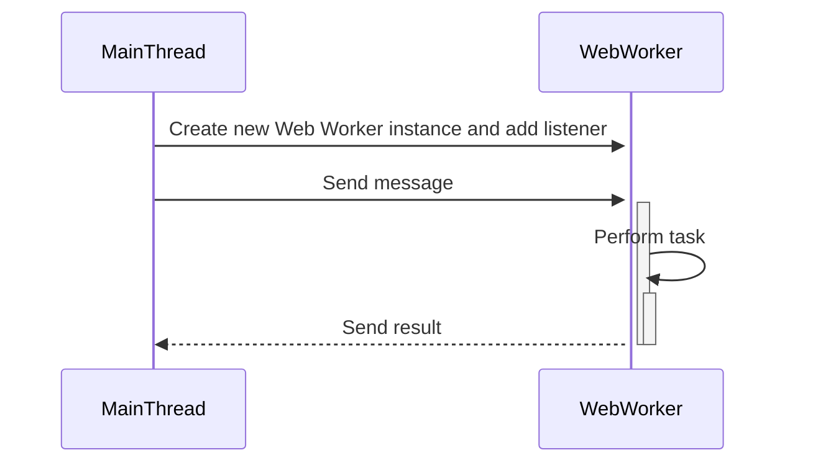
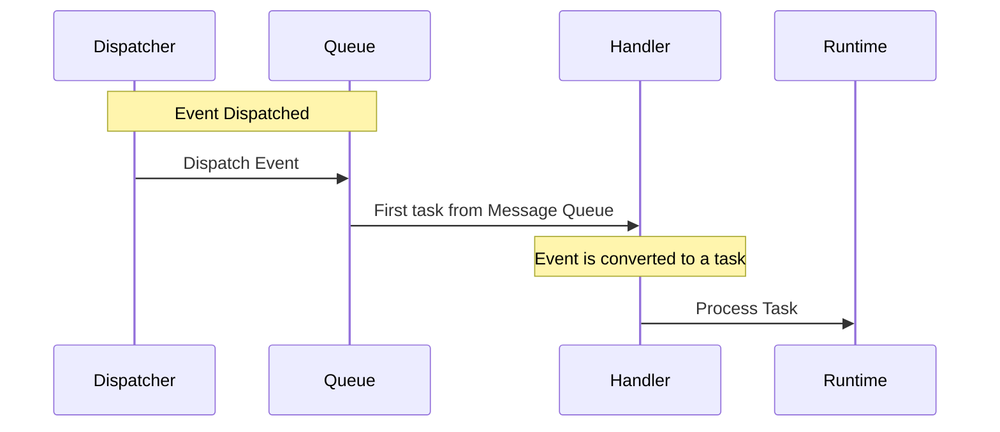
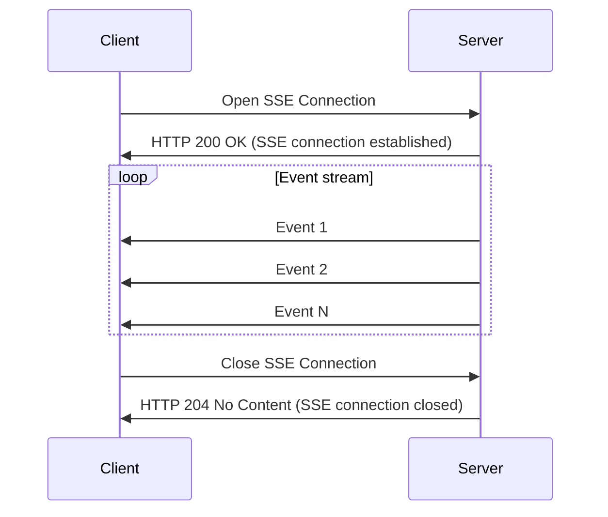

## R𝒶𝓃𝒹ℴ𝓂 𝒿𝒶𝓋𝒶𝓈𝒸𝓇𝒾𝓅𝓉 𝒷𝒾𝓉𝓈
```
 /\_/\  
( o.o ) 
 > ^ <
```
### 00. Javascript can do extension 
An `extension` in programming is a mechanism that enables the augmentation of features in an existing class without making direct modifications to the original class. It's a method to enhance the behavior and abilities of types without the need for subclassing. With extensions, you can incorporate additional functionality into an object after the object has been initially created.

```javascript
// class definition
class Person {
  constructor(firstName, lastName) {
    this.firstName = firstName;
    this.lastName = lastName;
  }
}
// creating an instance of Person
let person = new Person('Lenny', 'Kim');

// extending Person type
Person.prototype.fooBar = function() {
  console.log(`Hello, my name is ${this.firstName} ${this.lastName}`);
};

// majik -- person has fooBar method
person.fooBar();
```


### 01. Different ways of defining function
  1. A regular function is hoisted to top level by default, even when the code is the last statement of the file, it will be available everywhere.
  2. In constrast when an arrow function is called before there are defined, it will resolve to an error.
  3. Code inside the arrow function is not compiled until it is being called.
  4. Function created by function constructor is also hoisted to top level by default.
     
```javascript
// calling fooBar2 before it is declared
fooBar2() // this stil work since function is hoisted.

// with arrow function
const fooBar1 = () => { console.log(`fooBar1`);}

// regular function (hoisted)
function fooBar2() { console.log(`fooBar2`);}

// using function contructor to create new function
const addFunction = new Function('a', 'b', 'return a + b;');
const result = addFunction(2, 3);  // Result: 5
```


### 02. Dot notation and Bracket notation can access/mutate property the same way

In JavaScript, you have two primary methods to access and modify properties of an object: `dot notation` and `bracket notation`.

Dot notation is straightforward and direct, suitable when the key is known in advance. It offers a slight performance advantage due to its directness. On the other hand, bracket notation provides more flexibility, allowing keys to be determined dynamically at runtime, making it the preferred choice in such cases.

```javascript
let person = new Object();

// mutating with dot notation
person.something = 'foo';

// accessing with bracket notation
console.log(person['something']);
```


### 03. Javascript call(...) function reverse the order of calling method
In JavaScript, we can invoke a method using the `call` function, which allows us to call a method in the format `function.call(obj, ...)` instead of the usual `obj.function(...)`. This approach opens up various scenarios like method borrowing and enables the implementation of inheritance in JavaScript.

```javascript
function greet() {
  console.log(`Hello, ${this.firstName} ${this.lastName}`);
}

const person = { firstName: 'Lenny', lastName: 'Kim' };
// instead of object.method, we are doing method(obj, ...)
greet.call(person);
```


### 04. Javascript call and apply are similar except ...
The `apply` method in JavaScript is akin to the call method, with a notable difference: while call takes arguments individually, apply takes them in the form of an array. This makes it a valuable choice when you need to invoke a function with a defined context and a variable number of arguments supplied within an array-like structure. It enhances dynamism by allowing decisions to be made at runtime regarding the arguments being passed.

```javascript
function greet(foo) {
  console.log(`${foo}, ${this.firstName} ${this.lastName}`);
}

const person = { firstName: 'Lenny', lastName: 'Kim' };

// using call
greet.call(person, 'foo');

// using apply
greet.apply(person, ['foo']);

```


### 05. Javascript call and bind are similar except ...
The `call` and `bind` function are similar. `call` will run the function, while `bind` will create the function reference for you to call at a later time.

```javascript
function greet(foo) {
  console.log(`${foo}, ${this.firstName} ${this.lastName}`);
}

const person = { firstName: 'Lenny', lastName: 'Kim' };

// using call
greet.call(person, 'foo');

// using bind
const func = greet.bind(person, 'foo');
func();
```


### 06. Loose equity (==) vs Strict equity
Loose equity (`==`) will attempt to convert before doing comparison, while strict equity (`===`) does not convert. This is true for all except for `object`. See code below:

```javascript
// loose equity check
console.log(42 == '42');     // true (type coercion: '42' is coerced to number 42)
// strict equity check
console.log(42 === '42');    // false (different types)

const obj1 = { value: 1 };
const obj2 = { value: 1 };

// unexpected here. why is object comparing reference?
console.log(obj1 == obj2);   // Output: false, unexpected
console.log(obj1 === obj2);  // Output: false, expected

```

### 07. Inheritance the older way via Prototype
`Prototype` is a fundamental aspect of how objects and inheritance work in the language. Each JavaScript object has a prototype, which is another object that the current object inherits properties and methods from.

```javascript
// Superclass: Person
function Person(name) {
  this.name = name;
}

Person.prototype.greet = function() {
  console.log('my name is ' + this.name);
};

// Subclass: Student
function Student(name, studentId) {
  // Call the superclass constructor to initialize 'name'
  Person.call(this, name);
  
  // Initialize additional properties specific to Student
  this.studentId = studentId;
}

// Set up inheritance: Student inherits from Person
Student.prototype = Object.create(Person.prototype);
Student.prototype.constructor = Student;

// Additional method for Student
Student.prototype.showId = function() {
  console.log('Student ID:', this.studentId);
};

// Creating instances of Student
const student1 = new Student('Kenny', 'AA123');
const student2 = new Student('Lenny', 'BBB234');

// Using methods from both the Person and Student classes
student1.greet();      
student1.showId();
```

### 08. Proper class inheritance in Javascript
`extends` keyword is introduced in ES6.

```javascript
class Person {
  constructor(name) {
    this.name = name;
  }
  ...
}

class Student extends Person {
  constructor(name, occupation) {
    super(name);
    this.occupation = occupation;
  }
}
```
```
   |\---/|
   | ,_, |   < GIVE ME MORE !!
    \_`_/-..----.
 ___/ `   ' ,""- \  
(__...'   __\    |`.___.';
  (_,...'(_,.`__)/'.....+
```
### 09. Prototype Chain
Prototype chain is a fundamental mechanism that allows objects to inherit properties and methods from other objects. Every object in JavaScript has a prototype, which is either another object or null.

When you call a method or access a property of an object in JavaScript:

- JavaScript checks if the property is present on the current object.
- If the property is found on the current object, the process ends, and the value of the property is returned.
- If the property is not found on the current object, JavaScript looks at the object's prototype (which is accessible via the __proto__ property).
- JavaScript checks if the property is present on the prototype object.
- If the property is found on the prototype object, the process ends, and the value of the property is returned.
- If the property is not found on the prototype object, JavaScript continues up the prototype chain, checking the prototype of the prototype (and so on) until the property is found or reach end of the prototype chain.
- If the end of the prototype chain is reached and the property is not found, JavaScript returns undefined to indicate that the property is not defined.

### 10. Object deconstructing
`Object destructuring` allows you to extract properties from an object and assign them to variables in a more concise and convenient way. The name has to match the property name and only need to do assignment on the properties you are interested.

```javascript
const user = {
  name: 'Kenny',
  address: {
    city: 'Klondike',
    postalCode: '98001'
  }
};

const { address: { city, postalCode } } = user;

console.log(city);  
```

### 11. Nobody should use `var`
`var` is function scoped and can be re-declared many times without throwing any error. The code below looks like it should have compile error but it's ok thanks to var.

```javascript
function foo() {
    if(true) {
        var a = 0; // declare a 1st time
    }
    console.log(a); // accessing a outside of their scope, no problem
    var a = 1;      // declare a 2nd time, no problem
    console.log(a); // we are accessing the correct value
}
foo();
```

### 12. let or const
In JavaScript, let and const are block-scoped variables. When using const, you must initialize the variable, and once assigned, you cannot change its value. On the other hand, with let, you can declare a variable without immediate initialization and later assign and reassign values to it.

A good practice is to utilize `const` when you don't need to reassign the reference, promoting immutability. Conversely, opt for `let` when you need to reassign values during the program's execution.

```javascript
function foo() {
    const a = 42;
    let b = 43;
    const c = ['a', 'b', 'c'];
    
    a = 44;      // error, can't reassing
    b = 44;      // ok
    c = [];      // error, can't reassing
    c.push('d'); // ok, because you are not changing c.
}
foo();
```
### 13. Object spreading ...
`Object spreading ...` is a convenient and concise feature in JavaScript that enables rapid creation of shallow copies or merging of values within objects.

```javascript
const obj = { a: 1, b: 2 };
const copy = { ...obj };    // shallow copy

const obj2 = { c: 3, d: 4 };
const merged = { ...obj, ...obj2 }; // merged object
```

### 14. Javascript engine and it's environment
JavaScript engines universally operate in a single-threaded environment. They function through a single message loop or queue that processes one task at any given time. The larger JavaScript environment, like browsers or Node.js, encompasses multiple threads. For example, a fetch call occurs in an I/O thread; upon completion, it callbacks and enters the message loop. This singular thread is often referred to as the UI thread or main thread. Due to this single-threaded nature, there's no necessity for thread synchronization using locks.

### 15. Higher order functions
Higher order function facilitates functional programming concepts and allow for more modular, concise, flexible, and reusable code. Here are the functions commonly used:

```javascript
const numbers = [1, 2, 3, 4, 5];

// map
const squaredNumbers = numbers.map(num => num * num);       // returns [1, 4, 9, 16, 25]
// filter
const evenNumbers = numbers.filter(num => num % 2 === 0);   // returns [2, 4]
// reduce
const sum = numbers.reduce((acc, num) => acc + num, 0);     // return 15
// forEach
numbers.forEach(num => console.log(num));                   // prints 12345
// sort
const sortedNumbers = numbers.sort((a, b) => b - a);        // returns [5, 4, 3, 2, 1]
// every
const allEven = numbers.every(num => num % 2 === 0);        // return false because not everything is even
// some
const hasEven = numbers.some(num => num % 2 === 0);         // return true because there's at least 1 even number
// find
const result = numbers.find(num => num > 3);                // return 4, first element that match criteria
// flatMap
const arr = [1, 2, [3, 4, 5]];
const flattened = arr.flatMap(num => num);
console.log(flattened)                                      // returns 1, 2, 3, 4, 5. flatten hierarchy.

```
Higher-order functions are a powerful feature in functional programming, enabling concepts like callbacks, event handling, middleware in web frameworks, and more. They provide flexibility and allow for dynamic behavior based on the functions passed as arguments.

### 16. for loop vs forEach
Considering that we have an array, is it better to use traditional `for loop` or modern high level `forEach`? It is better to use traditional for loop because of performance, more control and ability to terminate early.

```javascript
const arr = [1,2,3,4,5];

arr.forEach(e => {     // forEach has overhead of creating closure.
   console.log(e);     // can't break or return
});

for (const e of arr) { // more control structure with regular for loop.
  console.log(e);
  if(e === 3) break;   // for loop can exit early, forEach can't.
  if(e === 4) return;  // exit entire function.
}
```

```
                     .
                    / V\  -- YAWN
                  / `  /
                 <<   |
                 /    |
               /      |
             /        |
           /    \  \ /
          (      ) | |
  ________|   _/_  | |
<__________\______)\__)
```

### 17. Script to machine code
JavaScript engines have the flexibility to execute programs using either bytecode (interpreted) or machine code (compiled). Typically, scripts are first converted into an Abstract Syntax Tree (`AST`), forming the basis for generating `bytecode`, which is efficient for interpretation.

During execution, the engine identifies hot segments or paths in the code. It optimizes these segments by compiling them into `native machine code`, enhancing performance significantly (this is `TurboFan` in `V8 engine`). However, this optimized code relies on specific assumptions, like the presence of certain properties. If these assumptions prove incorrect during execution, a process called de-optimization occurs. The engine discards the generated machine code and reverts to interpreted mode to maintain correctness.



### 18. {} vs Map for Dictionary functionality
For a long time, JavaScript developers used `{}` as a makeshift dictionary due to the absence of native Map support. However, with the availability of `Map` (as shown in the code snippet), it's advisable to use Map consistently. The key advantage of Map lies in its underlying implementation as a hashmap, ensuring fast retrieval with O(1) complexity compared to the O(n) complexity of regular objects represented by {}. Additionally, Map maintains the order of insertion, providing a predictable structure.

```javascript
const fakeMap = {
  key1: 'value1',
  key2: 'value2'
};

console.log(fakeMap.key1); 

const realMap = new Map();
realMap.set('key1', 'value1');
realMap.set('key2', 'value2');

console.log(realMap.get('key1'));
```

### 19. Never ever compare with NaN
The `NaN` value in JavaScript is of the type number. NaN is not equal to itself; hence, comparing NaN to anything, even itself, will result in false.

```javascript
const a = NaN;
console.log(a == NaN)    // false
console.log(a === NaN)   // false, woah
console.log(a === a)     // false, what ?!!
```

### 20. Trusting array.length can have side-effect
The behavior of the `length` property in JavaScript can be somewhat peculiar. When we directly assign a value to an index, the length of the array becomes index + 1. It's important to note that JavaScript doesn't pre-allocate memory for the entire array. This behavior can sometimes introduce subtle bugs that are challenging to debug, so caution is advised when working with arrays in this manner.

```javascript
const a = [];
a[10000000] = 5;
console.log(a.length); // returns 10000001
```

### 21. Javascript Promise
Promise allows you to handle asynchronous operations in a more organized and efficient manner. Promise can return resolve for success and reject for failure. While it is waiting, it is in Pending state.

Simple implementation of a function that returns a Promise.
```javascript
function waitForMs(ms)
 return new Promise((resolve, reject) => {
   setTimeout(() => {
     const success = true;
     if (success) {
       resolve('Operation successful');
     } else {
       reject(new Error('Operation failed'));
     }
   }, ms);
 });
}
```
State Machine for a Promise


### 22. Handling Promise that returned
You can use `then..catch pattern` or `async await` pattern. Async await pattern makes the code to be more natural to understand as though it is linear & synchronous. Then .. catch pattern looks like callback and using closure. It's really a matter of preference but async await can do more complex stuffs.

```javascript
// using then.catch pattern
waitForMs(200)
  .then((successMessage) => {
    console.log('Success:', successMessage);
  })
  .catch((error) => {
    console.error('Error:', error.message);
  });

// using async await pattern
async function calling() {
  try {
    const result = await waitforMs(200);
    console.log('Success:', result);
  } catch (error) {
    console.error('Error:', error.message);
  }
}
```
### 23. Wait for All Promises
You can use `Promise.all(arrayOfPromises)` to wait for all promise to resolve. If any promise reject, Promise.all will return immidietely and error. This is a good way to handle task synchronzation.

```javascript
const promise1 = Promise.resolve('Resolved Promise A');
const promise2 = Promise.resolve('Resolved Promise B');
const promise3 = Promise.reject(new Error('Rejected Promise C'));

// this will print 'At least one Promise rejected'
Promise.all([promise1, promise2, promise3])
  .then((values) => {
    console.log('All Promises resolved:', values);
  })
  .catch((error) => {
    console.error('At least one Promise rejected:', error);
  });

// this will print 'All Promises resolved'.
Promise.all([promise1, promise2])
  .then((values) => {
    console.log('All Promises resolved:', values);
  })
  .catch((error) => {
    console.error('At least one Promise rejected:', error);
  });
```

### 24. Wait for first promise to resolve or reject
`Promise.race(..)`.There are use cases where we want to get the first promise that `resolve` or `reject`, exit and not worry about the other promises.

```javascript
const promises = [
  new Promise((resolve) => setTimeout(() => resolve('Promise A'), 3000)),
  new Promise((resolve) => setTimeout(() => resolve('Promise B'), 1600)),
  new Promise((resolve) => setTimeout(() => resolve('Promise C'), 1500))
];

Promise.race(promises)
  .then((result) => console.log('Promise resolved:', result))
  .catch((error) => console.error('Promise rejected:', error));
```
```
    .----.   @   @
   / .-"-.`.  \v/   (HOW MUCH LONGER)
   | | '\ \ \_/ )
 ,-\ `-.' /.'  /
'---`----'----'
```
### 25. What happen when we await Promise(), how does javascript resume.
Javascript is single threaded. When awaiting a promise, Javascript won't run the next line until promise is fulfilled.
When encountering an `await` statement:

- JavaScript engine registers a continuation to be executed once the awaited Promise settles.
- Once the Promise settles, the registered continuation is added to the Javascript task queue.
- JavaScript event loop checks the Javascript task queue and, if not empty, processes the tasks in the order they were added.
- The registered continuation (the code after the await statement) is executed.

```javascript
console.log('calling await');
await waitForMs(10000);            // wait for 10s but what happen here?
console.log('promise completed');  // will print after 10s
```



### 26. Using additional thread to do work
Indeed, the JavaScript engine operates in a single-threaded environment. However, the broader JavaScript ecosystem, encompassing environments like Node.js and browsers, supports the `Web Worker` API. Web Workers enable the creation of threads and establish mechanisms for communication back to the JavaScript main thread. This capability empowers developers to execute intricate calculations, operations, or tasks without hindering the main thread, thereby optimizing the responsiveness and performance of web applications.

```javascript
// Create a new Web Worker
const worker = new Worker('worker.js');

// Listen for messages from the Web Worker
worker.addEventListener('message', (event) => {
  console.log('Web Worker msg:', event.data);
});

// In worker.js ---------------------------------------

// Listen for messages from the main thread
self.addEventListener('message', (event) => {
  console.log('Received message from main thread:', event.data);

  // Perform some work
  const result = event.data + ' Processed in Web Worker';

  // Send the result back to the main thread
  self.postMessage(result);
});
```


### 27. Can I have many threads?
Yes. Just create as many `Worker` object and listen to them.

```javascript

// Create multiple worker threads
const worker1 = new Worker('worker.js', { workerData: 'Worker 1' });
const worker2 = new Worker('worker.js', { workerData: 'Worker 2' });

// Listen for messages from the worker threads
worker1.on('message', (message) => {
  console.log('Received message from Worker 1:', message);
});

worker2.on('message', (message) => {
  console.log('Received message from Worker 2:', message);
});
```

### 28. Prefer null over undefined
It is common to check for both undefined and null for error. I think setting things to null or initialize to null. Undefined is really something forgotten. If you find any `undefined`, you should go fix it.

### 29. Accessing GPU (Part 1)
There are various ways to use Javascript to access GPU. The most common scenario is via `WebGL`. The snippet below is to create a canvas and getting a WebGL surface to render. Here is good [sample webgl](https://github.com/mdn/dom-examples/tree/main/webgl-examples/tutorial/sample8) and here's the [demo](https://mdn.github.io/dom-examples/webgl-examples/tutorial/sample8/).

```javascript
 <canvas id="glcanvas" width="640" height="480"></canvas>
...
const canvas = document.querySelector("#glcanvas");
  // Initialize the GL context
  const gl = canvas.getContext("webgl");

  // Only continue if WebGL is available and working
  if (gl !== null) {

  }
  ...
```

### 30. Accessing GPU (Part 2)
`TensorFlow.js` and similar APIs are specialized tools often used for machine learning (ML) tasks. Though this is more specialized. For general purpose, we can use `WebGPU` feature from Javascript. Sample [here](https://mdn.github.io/dom-examples/webgpu-compute-demo/script.js). Just like any work sent to GPU, it is commonly done in a shader. Another GPGPU library is [gpu.js](https://gpu.rocks/#/).

```javascript
// Compute shader
const shader = `
@group(0) @binding(0)
var<storage, read_write> output: array<f32>;

@compute @workgroup_size(64)
fn main(
  @builtin(global_invocation_id)
  global_id : vec3u,

  @builtin(local_invocation_id)
  local_id : vec3u,
) {
  // Avoid accessing the buffer out of bounds
  if (global_id.x >= ${BUFFER_SIZE}u) {
    return;
  }

  output[global_id.x] =
    f32(global_id.x) * 1000. + f32(local_id.x);
}
`;

async function init() {
  // 1: request adapter and device
  if (!navigator.gpu) {
    throw Error(`WebGPU not supported.`);
  }

  const adapter = await navigator.gpu.requestAdapter();
  if (!adapter) {
    throw Error(`Couldn't request WebGPU adapter.`);
  }

  const device = await adapter.requestDevice();

  // 2: Create a shader module from the shader template literal
  const shaderModule = device.createShaderModule({
    code: shader
  });
  ...
```

```
           __n__n__
    .------`-\00/-' 
   /  ##  ## (oo)    ~~ WHEN DO I EVER NEED TO USE GPU ?!!
  / \## __   ./
     |//YY \|/
     |||   |||
```
### 31. What are all the Javascript engine?
- `V8` - by far the most common Javascript engine. This is used in Chrome browser and Node.js runtime.
- `SpiderMonkey` - this is Javascript engine from Mozilla / Firefox.
- `JavascriptCore` - this one from Apple, used in Safari browser. Ever wonder why RN app is not consistant across Android & iOS? This is the reason.
- `Chakra` - this one is from Microsoft.
- `MuJS / Duktape / Moddable XS / JerryScript` - small embedded & iot devices.

### 32. Can Javascript leak memory?
Yes.

```javascript
function outerFunction() {
  const outer_data = new Array(999999).fill('xxxx xxxx');

  function innerFunction() {
    console.log(outer_data.slice(0, 1)); // using outer_data
  }

  return innerFunction;
}

let leakedClosure = outerFunction();
```

The above code will leak memory because innerFunction is holding to outer_data. To fix this, set leakedClosure to null.

```javascript
leakedClosure = null;
```

There are several ways memory can unintentionally be retained in JavaScript:

- Circular reference (A -> B -> A)
- Setting global variable to external like window object.
- Keeping maps or arrays in the global scope, holding everything in memory.
- Event handlers enclosed in closures.
- Timers not properly cleared.

### 33. WeakMap / WeakSet / WeakRef
The `WeakMap` in JavaScript offers a means to establish a collection of key-value pairs, where the keys are held via weak references. Essentially, entries in a WeakMap do not hinder the keys from being garbage-collected if there are no other references to them. The same concept applies to WeakSet (for Set) and WeakRef (for Object).

```javascript
const weakMap = new WeakMap();

// Create an object to use as a key
const keyObject = {};

// Add a key-value pair to the WeakMap
weakMap.set(keyObject, 'Value associated with keyObject');

// Retrieve the value associated with the keyObject
console.log(weakMap.get(keyObject)); // Output: Value associated with keyObject

// Remove the reference to the keyObject
keyObject = null;

// At this point, the keyObject is no longer needed, and it becomes eligible for garbage collection.
// The associated entry in the WeakMap will also be removed automatically.
```

### 34. Can Javascript handle binary?
Yes, Javascript can handle binary. Mainly using `Buffer` class. See examples below"

```javascript
const byteArray = [0x48, 0x65, 0x6C, 0x6C, 0x6F]; // ASCII codes for 'Hello'
const bufferFromByteArray = Buffer.from(byteArray);

console.log('Buffer from byte array:', bufferFromByteArray);
```

### 35. Javascript Binding for C++ library


Traditionally, library developers wrote code in C++ and utilized tools like `node-gyp` to build and bind the code into Node.js using addon APIs. However, the landscape is evolving. A contemporary approach involves leveraging `WebAssembly`, as detailed [More info here](https://developer.mozilla.org/en-US/docs/WebAssembly). With WebAssembly, you're no longer confined to a specific language; you can use a variety of languages such as C/C++, C#, Python, Go, Rust, Java, and Kotlin to write code and compile it into a WebAssembly module.

```javascript
// my-asm.js is created with 'emcc native_code.cpp -o my-asm.js'
// Load the WebAssembly module
const Module = require('./my-asm.js');

Module.onRuntimeInitialized = function() {
  console.log('WebAssembly module loaded');
  console.log('Result:', Module.foobar());
};
```
```
 /\ /\ 
((ovo))  (OWL HANGOUT @ C++ LIBRARY)
():::()
  VVV
```
### 36. What is Javascript bridge
A `JavaScript bridge` acts as a crucial mechanism, enabling bidirectional communication between JavaScript code (typically residing in a webview) and its host environment, whether it's iOS native, Android native, or Flutter. This functionality is pervasive in mobile development, particularly when integrating a webview within applications.

```javascript
// iOS
function callNative() {
    window.webkit.messageHandlers.iOS.postMessage("Hello from JavaScript!");
}
// Flutter
function sendMessageToFlutter() {
  const message = { type: 'FROM_WEBVIEW', data: 'Hello, Flutter!' };
  window.postMessage(JSON.stringify(message));
}
```

### 37. 'this' reference in Javascript
`this` in Javascript is referring to context and scope. Let's illustrate with code:

```javascript
// use1: adding property / method
function Person(name) {
  this.name = name;      // <- add property
  this.sayHi = () => {}  // <- add arrow function
}

const person = new Person('Lenny');
console.log(person.name);

// use2: accessing property using this
const obj = {
  prop: 'Hello',
  greet: function() {
    console.log(this.prop);  // <-- accessing the object's property using this
  }
};

// this in event handling
const button = document.getElementById('button');
button.addEventListener('click', function() {
  console.log(this);  // <-- Refers to the button element
});
```

### 38. Javascript statement doesn't need ; close anymore.
This is good to know but it really doesn't matter to me. I think it depends on your codebase. Just be consistent with it.

### 39. SharedArrayBuffer
In the context of data transfer between web workers, gpu workers and the main thread, there's typically a need to serialize, deserialize, and make copies of the data, which can be highly inefficient, especially in scenarios related to machine learning. However, the introduction of `SharedArrayBuffer` has addressed this inefficiency by enabling the sharing of a buffer across different execution contexts.

```javascript
const buffer = new SharedArrayBuffer(16);

// create worker and pass buffer reference to it
const worker = new Worker('worker.js');
worker.postMessage({ buffer });

// worker.js
onmessage = (event) => {
  const { buffer } = event.data;
  const int32Array = new Int32Array(buffer);

  // Access and manipulate the shared buffer
  int32Array[0] = 33;
};
```

### 40. XXXL number. BigInt
Javascript now support `BigInt` which can go larger than 2^53 - 1 (limit for number).

```javascript
const bigIntA = 1234567890123456789012345678901234567890n;
const bigIntB = BigInt('987654321098765432109876543210');

const sum = bigIntA + bigIntB;
const product = bigIntA * bigIntB;

console.log('Sum:', sum);         // Outputs: Sum: 1234567890123456789999999999999999990100n
console.log('Product:', product); // Outputs: Product: 1219326311126352697579906220182235292041254607981000n
```

### 41. Nullish Coalescing Operator (??) 
The `??` operator, also known as the nullish coalescing operator, serves to assign a default value if a variable is either null or undefined. This is distinct from the `||` operator, which developers have historically used to set default values. Here's a breakdown of the differences:

- `??` sets the default value if the variable is null or undefined.
- `||` sets the default value if the left-hand side (lhs) is evaluated as false. For example, const defaultValue = '' || 'default'; will always be set to 'default' unless the left-hand side is a truthy value other than an empty string.

```javascript
const userInput = null; // This could be null or undefined

// Using ?? to provide a default value
const defaultValue = userInput ?? 'default';

console.log(defaultValue); // Outputs: default
```

### 42. Dynamic Import
`Dynamic import` is a transformative addition to JavaScript. Unlike the traditional static import, which loads modules at compile-time, dynamic import allows for on-demand module loading during runtime, even within conditional branches. This has far-reaching implications:

- Facilitates lazy loading and code splitting, enhancing performance.
- Permits importing from external URLs.
- Optimizes performance by strategically placing modules that are seldom accessed into dynamic imports.

```javascript
const moduleUrl = 'https://url.com/path/remote-module.js';

import(moduleUrl)
  .then((module) => {
    // Module is now available for use
    module.someFunction();
  })
  .catch((error) => {
    console.error('Error loading module:', error);
  });
```

```
           _
       .__(.)< (TAKE ANOTHER BREAK)
        \___)
```

### 43. Optional Chaining (?.)
`Optional chaining`, a feature prevalent in languages like Swift and TypeScript, has become a first-class citizen in JavaScript. This enhancement significantly enhances code robustness by eliminating errors such as 'length is not a property of undefined'.

```javascript
const userName = user?.propertyDoesNotExist?.fooBar(); // userName will be undefined but no error accessing
```

### 44. Object.fromEntries
The `Object.fromEntries` method processes a 2D matrix formatted as key-value pairs and transforms it into a JavaScript object. The reverse of this function is `Object.entries(o)`.

```javascript
const entries = [
  ['name', 'Lenny'],
  ['id', 123]
];

const obj = Object.fromEntries(entries);

console.log(obj); // { name: 'Lenny', id: 123 }

// reversing

const obj = { a: 1, b: 2, c: 3 };
const entries = Object.entries(obj);

console.log(entries);
// Output: [['a', 1], ['b', 2], ['c', 3]]
```

### 45. Object.values and Object.keys
`Object.values` and `Object.keys` are two useful functions provided by JavaScript to work with objects. This can be useful to build dynamic applications.

```javascript
const person = { name: 'Kenny', id: 33 };

const values = Object.values(person);
console.log(values);  // Output: ['Kenny', 33]

const keys = Object.keys(person);
console.log(keys);    // Output: ['name', 'id']
```

### 46. Atomics features
JavaScript `Atomics` is a recent feature in JavaScript, resembling C11's stdatomic.h API. Atomics provides a set of APIs that ensure synchronization with `SharedArrayBuffer`. It's designed for environments with multiple threads, like Web Workers, enabling the use of shared resources while maintaining synchronization. The APIs:

- Atomics.add(typedArray, index, value)
- Atomics.sub(typedArray, index, value)
- Atomics.and(typedArray, index, value)
- Atomics.or(typedArray, index, value)
- Atomics.xor(typedArray, index, value)
- Atomics.load(typedArray, index)
- Atomics.store(typedArray, index, value)
- Atomics.wait(typedArray, index, value, timeout)
- Atomics.notify(typedArray, index, count)
- Atomics.exchange(typedArray, index, value)
- Atomics.compareExchange(typedArray, index, expectedValue, replacementValue)

Sample code to atomically store a value in ShareArrayBuffer in a thread-safe way.
```javascript
const sharedBuffer = new SharedArrayBuffer(4);  // Create a shared buffer of 4 bytes
const sharedArray = new Int32Array(sharedBuffer);  // Create a typed array to operate on the shared buffer

// Initial value in the shared array
sharedArray[0] = 99;
console.log('value:', sharedArray[0]);  // Outputs: value: 99

// In worker thread or other context.
// Atomics.store to atomically set a new value.
const newValue = 55;
Atomics.store(sharedArray, 0, newValue);
```

```
     _.-^^---....,,--       
 _--                  --_  
<                        >)
|          ATOMICS        | 
 \._                   _./  
    ```--. . , ; .--'''       
          | |   |             
       .-=||  | |=-.   
       `-=#$%&%$#=-'   
          | ;  :|     
 _____.,-#%&$@%#&#~,._____
```

### 47. setTimeout zero 
`setTimeout` with 0ms doesn't mean it will run right away. This is a trick to dispatch task to the end of the Javascript message queue. You can also use this technique to yield to break long running job to smaller chunks. Using `requestAnimationFrame` or `Promise.resolve().then(() => {})` can achieve the same result.



Sample code:
```javascript
setTimeout(() => {
    console.log("task 1");
  }, 0);
setTimeout(() => {
    console.log("task 2");
  }, 0);
console.log("done");

// will output :
// done
// task1
// task2
```

### 48. Service Worker
Although `service worker` is not a Javascript feature, it is very common to use them in any chrome project such as web pages, single page application & chrome extensions. A service worker is a type of web worker, a script that runs in the background of a web application, separate from the main browser thread. It acts as a programmable proxy, allowing control over network requests, caching, and push notifications for web applications. Service workers enable the creation of powerful features like offline support, background synchronization, and improved performance.
```javascript
// Register the service worker
if ('serviceWorker' in navigator) {
  navigator.serviceWorker.register('/service-worker.js')
    .then(registration => {
      console.log('Service Worker registered with scope:', registration.scope);
    })
    .catch(error => {
      console.error('Service Worker registration failed:', error);
    });
}

// Service worker script (service-worker.js)
self.addEventListener('install', event => {
  event.waitUntil(
    caches.open('my-cache').then(cache => {
      return cache.addAll([
        '/',
        '/index.html',
        '/styles.css',
        '/script.js'
      ]);
    })
  );
});

self.addEventListener('fetch', event => {
  event.respondWith(
    caches.match(event.request).then(response => {
      return response || fetch(event.request);
    })
  );
});
```
### 49. PostMessage
The `postMessage` API serves as a crucial communication mechanism that facilitates interaction between various components in web development, including Service Workers, the main page, other frames, different windows, and even Chrome extensions. This communication can be 1-way or 2-ways but need to be targeted, allowing for seamless exchange of data and messages between these components, enhancing the overall functionality and capabilities of the web application.

```javascript
const targetWindow = window.parent; 
const message = 'this is a message!';

// Sending a message to the target window or frame
targetWindow.postMessage(message, '*');

// parent window (receiving)
window.addEventListener('message', event => {
    console.log('Received message:', event.data);
});
```

### 50. BroadcastChannel
BroadcastChannel allows for broadcasting a message to all instances listening on the same channel within the same origin. While PostMessage is 1 to 1, BroadcastChannel to 1 to many and is more suitable for cases where you need to synchronize state or share data among different instances of your application.

```javascript
// Publisher
// Creating a new BroadcastChannel named "mychannel"
const publisher = new BroadcastChannel('mychannel');

// Subscriber 1
const sub1 = new BroadcastChannel('mychannel');

// Listening for messages on the channel
sub1.addEventListener('message', (event) => {
  console.log('Received message:', event.data);
});

// Subscriber 2
const sub2 = new BroadcastChannel('mychannel');

// Listening for messages on the channel
sub2.addEventListener('message', (event) => {
  console.log('Received message:', event.data);
});

// Sending a message on the channel
publisher.postMessage('Hello, everyone! This is a broadcasted message.');

```

### 51. CustomEvent
If you felt that `PostMessage` is overkill & your requirement is within the same application, you should look at `CustomEvent`. You can send this event to any DOM element and receiver can control bubbling and cancel.

```javascript
const customEvent = new CustomEvent('customEvent', {
  detail: { message: 'This is a custom event.' },
  bubbles: true,
  cancelable: false
});

// send custom event to a DOM element
document.dispatchEvent(customEvent);

// Add an event listener to handle the custom event
document.addEventListener('customEvent', event => {
  console.log('Custom event received:', event.detail.message);
});

```

### 52. JSON reviver
`JSON.parse` and `JSON.stringify` are commonly used API in Javascript when dealing with data. In `JSON.parse`, you can optionally pass in a `reviver function` which can be a transformer function. Note that JSON.parse will still need to complete because passing into reviver function so it is **not** a streaming API. Sample here:

```javascript
const jsonString = '{"date": "2023-10-14T08:30:00.000Z", "amount": "100", "child" : { "name": "", "value": "" }}';

const reviver = (key, value) => {
  if (key === 'date') {
    return new Date(value);
  } else if (key === 'amount') {
    return parseFloat(value);
  } else {
    return undefined;
  }
  return value;
};

const o = JSON.parse(jsonString, reviver);
// o.date   -> [Date object]
// o.amount -> 100.0
// o.child  -> don't exist

```

### 53. ReadableStream & WritableStream
This is part of Javascript streams API [more info](https://developer.mozilla.org/en-US/docs/Web/API/Streams_API). The Streams API (ES2018) allows JavaScript to programmatically access streams of data received over the network and process them as desired by the developer. The benefit when done right is that you can get chunks of data as it is coming in and able to time slice and process bits earlier instead of waiting for all data to come in (synchronously) and then process.

Code sample:
```javascript
async function handleStream() {
const response = await fetch('https://jsonplaceholder.typicode.com/posts', { method: 'GET' });

if (!response.ok) {
  throw new Error('Network response was not ok');
}

const reader = response.body.getReader();

while (true) {
  const { done, value } = await reader.read();

  if (done) {
    console.log('Stream complete');
    break;
  }

  // Process the chunk of data (value)
  console.log('Received chunk:', new TextDecoder().decode(value));
}
}

handleStream().catch(error => console.error('Error:', error));
```

```

 (\(\ 
 ( -.-)     < TOO MUCH INFO
 o_(")(")

```

### 54. EventSource (SSE)
The `EventSource` API provides a straightforward and efficient way to receive real-time updates from a server through a single HTTP or HTTPS connection. The connection is initiated by a single request and remains open, allowing the server to send multiple response streams to the client, which are then closed after each event. The server-sent events (SSE) endpoint on the server must be set up to send events in a specific format, usually utilizing the text/event-stream content type.

Compared to receiving a single block of updates all at once from a single endpoint API, EventSource allows for a faster, more progressive and responsive update delivery to the client. This results in a smoother flow of updates and a better user experience. While it's possible to achieve similar functionality by making multiple HTTP calls from the client, utilizing EventSource reduces resource usage on both the client and server sides, making it an efficient choice for real-time updates.

Sample client code:
```javascript
const eventSource = new EventSource('https://<your-url>/sse');

eventSource.addEventListener('message', (event) => {
  console.log('Received message:', event.data);
});

eventSource.addEventListener('error', (event) => {
  console.error('EventSource error:', event);
});
```



### 55. WebSocket
`WebSocket` enable full-duplex communication, making them ideal for real-time, bidirectional data exchange. This feature is particularly useful for applications like multiplayer games, where seamless communication in both directions is essential. The programming approach for WebSockets is akin to that of `EventSource`. WebSockets can facilitate communication not only from the client to the server but also between servers, making them versatile for a wide range of applications.

```javascript
const socket = new WebSocket('ws://<url>); 

socket.addEventListener('open', (event) => {
  console.log('WebSocket connection opened:', event);
  socket.send('Hello, server!');
});

socket.addEventListener('message', (event) => {
  console.log('Received message from server:', event.data);
});

socket.addEventListener('close', (event) => {
  console.log('WebSocket connection closed:', event);
});

socket.addEventListener('error', (event) => {
  console.error('WebSocket error:', event);
});
```

### 56. Asyncronous Iteration
Asynchronous iteration, introduced in ES2018, is a powerful feature that allows developers to work with asynchronous data sources in a streamlined and efficient manner. It's particularly useful in scenarios where you need to iterate over collections or data streams that involve asynchronous operations. 

```javascript
async function* asyncGenerator() {
  yield 'a';
  await new Promise(resolve => setTimeout(resolve, 1000));
  yield 'b';
}

(async () => {
  for await (const item of asyncGenerator()) {
    console.log(item);
  }
})();
```
### 57.Iterate an array
The many ways to iterate through an array.

```javascript
const arr = [1, 2, 3, 4];

// regular for
for (let i = 0; i < arr.length; i++) {
  console.log(arr[i]);
}

// for..of
for (const element of arr) {
  console.log(element);
}

// arr.forEach
arr.forEach(element => {
  console.log(element);
});

// arr.map
const newArray = arr.map(element => element * 3);
console.log(newArray);

// for..of entries
for (const [index, value] of arr.entries()) {
  console.log(index, value);
}

// for..in
for (const value in arr) {
  console.log(value);
}
```

### 58. Stack using Array
Array has built-in function `push` and `pop` which make it work like a `Stack (FIFO)`.

```
let stack = [];
stack.push(1);         // [1]
stack.push(2);         // [1,2]

let val = stack.pop(); // [1]
```

### 59. Queue using Array
Array has `shift` and `push` which can perform like `dequeue` and `enqueue`. To make it clearer, we can create a Queue class as follow:

```javascript
class Queue {
  constructor() {
    this.queue = [];
  }

  enqueue(item) {
    this.queue.push(item);
  }

  dequeue() {
    return this.queue.shift();
  }

  isEmpty() {
    return this.queue.length === 0;
  }

  size() {
    return this.queue.length;
  }
}

// Usage
const queue = new Queue();
queue.enqueue(10);
queue.enqueue(20);
console.log(queue.dequeue()); // Output: 10
console.log(queue.size());    // Output: 1

```

```
    |\__/,|   (`\
  _.|o o  |_   ) )
-(((---(((--------
```

### 60. Typed Array
Regular Javascript Array is storing as object. There are Typed Array introduced in Javascript to handle binary. Typed Arrays in JavaScript provide a way to work with raw binary data in a structured and efficient manner. They are array-like objects that represent arrays of specific numeric data types, allowing you to deal with low-level binary data directly. Here are the Typed Array available:

- Int8Array
- Uint8Array
- Uint8ClampedArray
- Int16Array
- Uint16Array
- Int32Array
- Uint32Array
- Float32Array
- Float64Array

### 61. How do you put shape into SharedArrayBuffer?
You can use any of the Typed array to shape your shared array buffer.

```javascript
const buffer = new SharedArrayBuffer(16); // Allocate a buffer of 16 bytes
const intArray = new Int32Array(buffer);  // Create an Int32Array backed by the buffer

// Set values in the IntArray
intArray[0] = 42;
intArray[1] = 10;
```

### 62. escape vs encodeURIComponent
In earlier day of Javascript, `escape` and `unescape` were widely used for URI encoding. However, `escape` does not comply with ECMA standard and can output inconsistent result. `encodeURIComponent` and `decodeURIComponent` is the way to do URI encoding and decoding.

```javascript
const originalString = 'Hello World!';
const encodedEscape = escape(originalString);
const encodedURIComponent = encodeURIComponent(originalString);

console.log('escape():', encodedEscape); // May output: "Hello%20World!" or "Hello+World!"
console.log('encodeURIComponent():', encodedURIComponent); // Output: "Hello%20World!"
```

### 63. Base64 handling
Base64 encoding uses a specific set of 64 characters to represent binary data as a sequence of printable ASCII characters. Javascript application use Base64 in:

- Passing data as part of URL
- Image encoding in Base64 `data:image/png;base64`
- Sending binary data over text protocol
- Storing blob in JSON
- Auth JWT token.

```javascript
const dataToEncode = 'Hello, world!';
const encodedData = btoa(dataToEncode);
console.log(encodedData) // SGVsbG8sIHdvcmxkIQ==

const decodedData = atob(encodedData);
console.log(encodedData) // Hello, world!
```

### 64. TextEncoder & TextDecoder
Use TextEncoder & TextDecoder to convert between String and Byte array (based on your encoding). Sample code:

```javascript
const encoder = new TextEncoder();
const decoder = new TextDecoder('utf-8'); // can be other encoding

const text = 'Lenny Kim';
const encodedData = encoder.encode(text);
// Uint8Array(9) [
//   76, 101, 110, 110,
//  121,  32,  75, 105, 109 ]
console.log(encodedData);

// Decode the encoded bytes back to a string
const decodedText = decoder.decode(encodedData);

// Lenny Kim
console.log(decodedText); 
```

### 65. Working with Binary data directly
Use `blob` in `Response` and you can access `arrayBuffer` and then you can shape it to Typed Array.

```javascript
fetch('https://<url>/binaryreturn', { method: 'GET' })
  .then(response => {
    return response.blob();
  })
  .then(blobData => {
    return blobData.arrayBuffer();
  })
  .then(arrayBuffer => {
    const uint8Array = new Uint8Array(arrayBuffer);
    console.log('Uint8Array:', uint8Array);
  })
```

### 66. AbortController & AbortSignal
Using `AbortController` and `AbortSignal`, you can abort/cancel operation. You can use it to abort a running promise operation or in this example, cancelling a fetch call.

```javascript
const controller = new AbortController();
const signal = controller.signal;

setTimeout(() => {
  controller.abort();
  console.log('Request aborted');
}, 5000);

fetch(url, { signal })
  .then(response => response.json())
  .then(data => console.log('Response:', data))
  .catch(error => console.error('Error:', error));
```

### 67. Timers
There are 3 ways to do timer in Javascript. It is probably good to know when to use which API

- `setTimeout`  (does not repeat)
- `setInterval` (will repeat by default)
- `requestAnimationFrame` (will get call everytime surface renders)

```javascript
setTimeout(() => {
  console.log('This will be executed after 1 sec.');
}, 1000);

const intervalId = setInterval(() => {
  console.log('This will be executed every 2 seconds until clearInterval(..) is called');
}, 2000);

function animate() {
  console.log('Animating...');
  requestAnimationFrame(animate);
}
```
### 68. Static Class functionality
`Static Class` is available in Javascript. You can have public / private static method and static field. There is no static contructor in Javascript.

```javascript
class MyClass {
  static staticProperty = 'Some value';
  static #privateProperty = 'foo';

  static staticMethod() {
    console.log('This is a static method');
    this.#privateMethod(); // this call is ok
  }

  static #privateMethod() {}
}

console.log(MyClass.staticProperty);  // Accessing a static property
MyClass.staticMethod();               // Calling a static method
MyClass.privateMethod();              // Error, can't call this from outside
console.log(MyClass.privateProperty); // Error, can't call this from outside

```
```
 ^...^
<_- -_>   
  \_/    (SLEEPY)
        
```
### 69. undefined
It's important to avoid leaving variables as `undefined` in your JavaScript code. Variables are considered undefined when they haven't been assigned or initialized. However, it's essential to be aware of certain undefined behaviors in JavaScript that can affect your code:
```javascript
console.log(undefined == null);  // true
console.log(undefined === null); // false

function foo() {
    // no return statement
}

const result = foo();
console.log(result); // undefined
```
### 70. String Interning is default
When you create a String in JavaScript using a string literal (e.g., "hello"), modern JavaScript engines often optimize by interning the string. This means that if you create multiple string literals with the same value, they may actually reference the same memory location rather than creating multiple copies of the string.

```javascript
const str1 = "hello";
const str2 = "hello";

console.log(str1 === str2); // true because both are the same ref.

// if you want a different ref, do this.
const str3 = String("hello");
console.log(str1 === str3); // false because of different ref.

```
### 71. typeof operator
The `typeof` operator in JavaScript is used to determine the type of a value or expression. Here are some of the types based on the value.

```javascript
typeof 7;              // "number"
typeof "lenny";        // "string"
typeof false;          // "boolean"
typeof undefined;      // "undefined"
typeof {};             // "object"
typeof null;           // "object"        <-- strange
typeof function() {};  // "function"

let ref = () => {};
typeof ref;            // [function: ref] <-- reference to a function
```

### 72. Quirks about instanceof
The `instanceof` operator  in JavaScript is used to check if an object is an instance of a particular class or constructor. While it is simply to understand, here are some quirks about this operator:

```javascript
const boxedStr = new String('hello')
const boxedNumber = new Number(7)
const arr = [1, 2, 3];

console.log("hello" instanceof String)     // false. <- primitive is not Dtring
console.log(boxedStr instanceof String)    // true.  <- boxed String
console.log(7 instanceof Number)           // false. <- primitive is not Number
console.log(boxedNumber instanceof Number) // true.  <- boxed Number

console.log(arr instanceof Array);         // true
console.log(arr instanceof Object);        // true.  <- array is from object
```

### 73. String("") vs new String("")
- `String("")` is a function call to the String constructor. However, because it's called without the new keyword, it behaves like a conversion function. It converts the string literal "hello" to a string primitive.
- `new String("")` creates a new instance of the String object using the String constructor. The result is an object of type String.


### 74. Callback vs Closure
`Callback` is a function that is pass into a function as param to facilitate asynchronous programming. 

`Closure` is a function that return from a function so that you can use that returned function later. A closure is a function that "remembers" the environment in which it was created, including the variables and parameters available at that time. It encapsulates the state of the surrounding function, allowing access to its scope even after the outer function has finished executing.

```javascript
// Callback example

function performTask(data, callback) {
  // simulate async
  setTimeout(function() {
    callback(data);
  }, 1000);
}

// Calling the function with a callback
performTask('some data', (result)=> { console.log(result)});

// Closure example
function outerFunction(outerValue) {
  return function innerFunction(innerValue) {
    console.log(outerValue, innerValue);
  };
}

let closure = outerFunction('Outer value');
// call this much later, closure will keep outerFunction around
closure('Inner value');
// good to set to null to release
closure = null;
```

```
                (\__/)  .~    ~. ))
                /O O `./      .'
   (ALMOST     {O__,   \    {
    THERE)       / .  . )    \
                 |-| '-' \    } ))
                .(   _(   )_.'
               '---.~_ _ _&
```

### 75. Common Math issues in Javascript
Here are some common Math issues to beware of:

```javascript
// Unexpected results due to floating-point precision errors
let a = 0.1 + 0.2;      
console.log(a);                     // 0.30000000000000004

// to fix this
const roundedResult = Math.round(a * 1000) / 1000;
console.log(roundedResult);         //  0.3

// Need to spread array in min/max
const numbers = [1, 2, 3, 4];
console.log(Math.max(numbers));     // NaN
console.log(Math.max(...numbers));  // 4

// The Math.round() function rounds to the nearest integer.
// However, for numbers exactly halfway between two integers,
// it rounds to the nearest even number. This is known as
// the 'round half to even'.
console.log(Math.round(1.5));       // 2
console.log(Math.round(2.5));       // 2 but why?

// Divide by zero is ok in Javascript
console.log(1 / 0);                 // Infinity
console.log(-1 / 0);                // -Infinity
console.log(0 / 0);                 // NaN

// Infinity is the result of numeric overflow
console.log(Math.pow(2, 1024));     // Infinity
```

### 76. Do not use eval(..)
Do not use `eval(..)` function has security risks and potential performance issues. Using eval() with untrusted or user-supplied data can lead to vulnerabilities like code injection and should be avoided.

### 77. Class vs Module
`class` and `module` are different concept in Javascript. Classes define the blueprint for objects and promote object-oriented programming principles like encapsulation, inheritance, and polymorphism. `module` is a way to modularize big project into different files for each of maintenance and being a unit. Modules help in separating concerns, promoting code reusability, maintainability, and scalability. Whenever you need to separate functionality (function or class or variable), you need module `export` and `import`.

```javascript
// C1.js
// export module
export default class C1 {
  constructor(value) {
    this.value = value;
  }
}

// Caller.js
// import module
import MyClass from './C1.js';

const instance = new C1(42);

----

// module.js
export const greeting = 'Hello, World!';

export function greet(name) {
  return `Hello, ${name}!`;
}

// caller2.js
import { greeting, greet } from './module.js';

console.log(greeting);      // Outputs: Hello, World!
console.log(greet('Lenny')); // Outputs: Hello, Lenny!
```

### 78. debugger keyword
You can break into a debugger from your JavaScript code using the `debugger` statement. The debugger statement is a JavaScript statement that tells the debugger to pause the execution of your code at that point, allowing you to inspect the current state, variables, and the call stack.

```javascript
function foo() {
  let x = 7;
  // code...
  debugger;  // Execution will pause here and you can trace from IDE/Devtools
  // code...
}

foo();
```

### 79. console tricks
`console` object in JavaScript provides several useful methods beyond `log`, `warn`, and `error` that can help you with debugging, profiling, and improving the efficiency of your code. Here are example for `table`, `time`, `timeEnd`, `trace` & `assert`.

```javascript
// console.table for formatting
const data = [
  { name: 'Lenny', id: 1234 },
  { name: 'Kenny', id: 4567 }
];

console.table(data);

┌─────────┬─────────┬──────┐
│ (index) │  name   │  id  │
├─────────┼─────────┼──────┤
│    0    │ 'Lenny' │ 1234 │
│    1    │ 'Kenny' │ 4567 │
└─────────┴─────────┴──────┘

// console.time for performance profiling

console.time('layout');
// Some code to be measured
console.timeEnd('layout');

// console.trace

function b() {
  console.trace('Trace:');
}

b();

// Trace: Trace:
//    at b (/tmp/8mfnyf9B14.js:9:11)
//    at Object.<anonymous> (/tmp/8mfnyf9B14.js:12:1)
//    at Module._compile (node:internal/modules/cjs/loader:1256:14)

// console.assert (used in unit test)

console.assert(true);   // everything ok, no op.
console.assert(false);  // show error

```

### 80. Use Template literals
Template literals allow you to interpolate variables or expressions into a string by using ${} syntax within the template string. Use this instead of str1 + str2. This method makes code more readable.

```javascript
const num = 7;
const name = 'Lenny';

console.log(`The value of num is: ${num}, name: ${name}`);
```

### 81. Promise.any
`Promise.any` is a different control structure than `race` and `all`. `Promise.any` return a new promise as soon as one of the input promises (an iterable of promises) is fulfilled, or it rejects if all of the input promises are rejected.

```javascript
const promise1 = new Promise((resolve, reject) => {
  setTimeout(() => resolve('Promise 1 fulfilled'), 400);
});

const promise2 = new Promise((resolve, reject) => {
  setTimeout(() => reject(new Error('Promise 2 rejected')), 800);
});

const promise3 = new Promise((resolve, reject) => {
  setTimeout(() => resolve('Promise 3 fulfilled'), 1000);
});

Promise.any([promise1, promise2, promise3])
  .then((value) => {
    console.log('At least one promise is fulfilled:', value); // promise1 return
  })
  .catch((error) => {
    console.error('All promises were rejected:', error);      // all promised rejected
  });
```

### 82. More behavior to know in Javascript String
`String` is immutatable in Javascript and you can't change character in a `String` other than creating a new String instance.
- Using `+ operator` with String will behave depending on context `eg. var result = 5 + "5"; // "55"`
- Assigning with string[index] will never error out but it does nothing. `let a = '123'; a[1] = 'b'; // '123'`
- String is encoded with UTF-16 (means 2 bytes per character), you can do unicode in it. `var unicodeString = "\u{1F609}"; // emoji`
- 
### 83. Javascript Isolates (Advanced)
With `V8` engine, Javascript engine is always running in a single thread within an `isolate`. An isolate in V8 represents a separate instance of the V8 engine. Each isolate has its own memory heap and JavaScript context. This means that variables, objects, and code within one isolate are isolated from those in another isolate. Isolates are used to enable concurrent JavaScript execution without interference between different instances of V8. This isolation is helping in security & performance.

Isolate has context, this context is the environment which the Javascript is running with. Context can be `node.js` or `chrome browser` or `web worker` or other environment hosting a javascript engine with a thread.

You can create your own isolate with the sample below in node.js. 

```javascript
const v8 = require('v8');

// Create a new V8 isolate
const isolate = new v8.Isolate();

// Create a new context within the isolate
const context = isolate.createContext();

// Enter the context to run code
isolate.enter();
v8.Context.Run(context, "console.log('from isolate!')");
isolate.exit();
```

### 83. Javascript Bytecode & Web Assembly
Javascript `bytecode` is an intermediate code that Javascript engine use. The internals of `bytecode` varies from one Javascript engine to the next. For eg. bytecode is V8 is different from JavascriptCode. `WebAssembly (Wasm)` is an attempt to standardize and provide a common bytecode format that can be executed efficiently across different web browsers and platforms. WebAssembly is a binary instruction format designed as a portable compilation target for high-level programming languages. It aims to enable execution at near-native speed and efficiency across diverse hardware and software platforms.

```
  \o/
   |       We did it!
  / \
```
